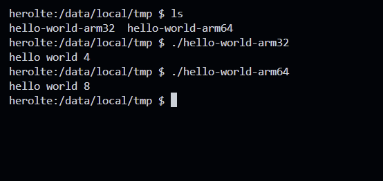

# Android Cross Complie

참고 : [pol4bear](https://github.com/pol4bear/android-cross-compile)

1. x86_64  
    1. ```./build.sh```  
    2. make  

2. arm64  
  
    1. ```./build.sh arm64```
    2. make
  
3. arm32  
    1. ```./build.sh arm32```
    2. make


### build.sh내용
```
#!/bin/bash

ARCHITECTURE=$1

# Clean up previous build-related files
rm -rf CMakeCache.txt CMakeFiles cmake_install.cmake Makefile

if [ -z $ARCHITECTURE ]; then
    cmake .
    exit 1
fi

if [ $ARCHITECTURE == "arm64" ]; then
    if ! cmake -DCMAKE_TOOLCHAIN_FILE=$AARCH64 .; then
        echo "CMake Error: Failed to configure the arm64 build"
        exit 1
    fi
    exit 1
fi

if [ $ARCHITECTURE == "arm32" ]; then
    if ! cmake -DCMAKE_TOOLCHAIN_FILE=$ARMV7A .; then
        echo "CMake Error: Failed to configure the arm32 build"
        exit 1
    fi
    exit 1
fi

# If an unsupported architecture is provided
echo "Error: Unsupported architecture specified"
exit 1
```


cmake에 사용된 환경변수 $ARMV7A, $AARCH64는 ~/.bashrc, ~/.zshrc에 저장하였습니다.

```

# ARM64 CMAKE BUILD
export AARCH64=/home/kali/Android/cmake/arm64.cmake

# ARM32 CMAKE BUILD
export ARMV7A=/home/kali/Android/cmake/arm32.cmake
```


### 실행 화면
