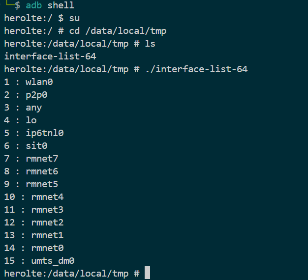

# pcap-cross-complie


## 사용법
```
$ bash build.sh [ arm64 | arm32 ]
```

## libpcap 컴파일 과정  

```
$ export Android=/path/to/android.cmake
$ 혹은 ~/.zshrc | ~/.bashrc에 직접 추가
```

```
$ wget https://www.tcpdump.org/release/libpcap-1.10.4.tar.xz
$ tar -xf libpcap-1.10.4
$ cd libpcap-1.10.4
$ mkdir build
$ cd build
$ cmake -DCMAKE_TOOLCHAIN_FILE=$Android [-DBIT=32] \
        -DDISABLE_DBUS=True \
        -DDISABLE_DPDK=True \
        -DCMAKE_INSTALL_PREFIX=/path/to/you/want/dir/sysroot \
        -DBUILD_SHARED_LIBS=False \
        ..
$ make install
```

## 소스코드 컴파일
```
$ cd /path/to/interface-list
$ bash build.sh [ arm32 | arm64 ]
```

## 확인
```
$ adb shell
$ su
$ cd /data/local/tmp
$ ./interface-list-[ 32|64 ]
```


## 원본
[Kredsya](https://github.com/Kredsya/android-cpp-network/tree/master/interface-list)
